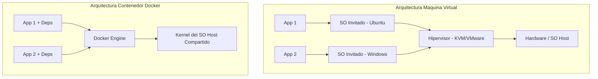
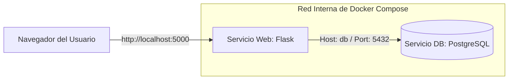
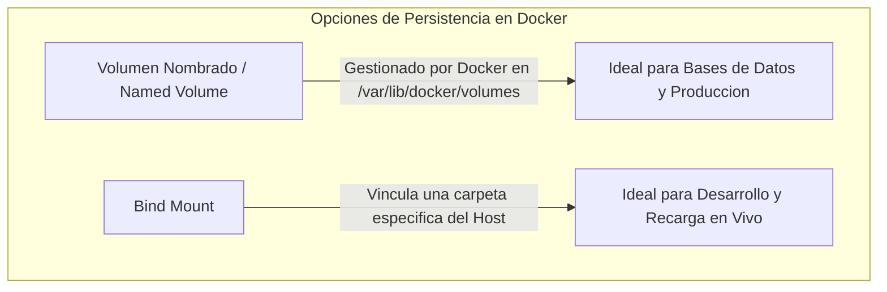
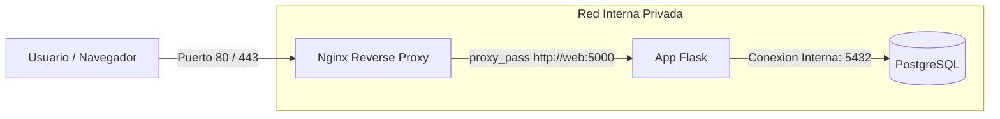

# Manual del Docente: Guía de Clase Sesión por Sesión
## Curso: Docker desde Cero - Crea y Despliega Aplicaciones (10ma Edición 2026)
### Universidad Nacional de Ingeniería (UNI) - Programa de Iniciación Tecnológica (PIT)
**Docente:** Ing. Cristian Jampier Chileno Segundo | OTI - UNI

---

## 🎯 Presentación del Manual
Este manual ha sido elaborado exhaustivamente para servir como la **guía definitiva del docente** para dictar el curso **Docker desde Cero: Crea y Despliega Aplicaciones (10ma Edición 2026)**.

Está estructurado sesión por sesión (de la Sesión 1 a la Sesión 6) alineado 100% con el material oficial en PDF y las diapositivas de la 10ma Edición ubicadas en la carpeta oficial (`OTI - 2026\PIT - VIRTUAL - DOCKER CURSO - 10MA EDICION`). Para cada sesión se incluye:
1. **Objetivos Didácticos & Mapa Mental de la Sesión.**
2. **Guía de Explicación Teórica (Paso a Paso con Analogías del Mundo Real).**
3. **Diagramas de Arquitectura (Mermaid).**
4. **Laboratorios Prácticos con Código Fuente Completo (Flask, PostgreSQL, Nginx, Dockerfile, Compose).**
5. **Comandos Ejecutables Copia-Pega para Demostración en Vivo.**
6. **Errores Frecuentes de los Alumnos y Cómo Solucionarlos.**
7. **Preguntas de Autoevaluación y Checklist de Cierre.**

---

## 📋 Tabla de Contenidos del Curso
1. [Sesión 1: Introducción, Fundamentos y Tu Primera Aplicación](#sesión-1-introducción-fundamentos-y-tu-primera-aplicación)
2. [Sesión 2: Dockerfile Profesional, Capas y Buenas Prácticas](#sesión-2-dockerfile-profesional-capas-y-buenas-prácticas)
3. [Sesión 3: Orquestación Local con Docker Compose y Multi-Contenedor](#sesión-3-orquestación-local-con-docker-compose-y-multi-contenedor)
4. [Sesión 4: Redes Docker, Persistencia de Datos, Healthchecks y Backups](#sesión-4-redes-docker-persistencia-de-datos-healthchecks-y-backups)
5. [Sesión 5: Reverse Proxy con Nginx, Seguridad y Producción Local](#sesión-5-reverse-proxy-con-nginx-seguridad-y-producción-local)
6. [Sesión 6: Configuración Multi-Entorno, Debugging Profesional y Proyecto Final](#sesión-6-configuración-multi-entorno-debugging-profesional-y-proyecto-final)

---

## Sesión 1: Introducción, Fundamentos y Tu Primera Aplicación

### 1.1 Objetivos de la Sesión
- Comprender el problema histórico *"En mi máquina funciona"* y la necesidad de la contenerización.
- Diferenciar claramente entre Virtualización Tradicional (VMs) y Contenerización (Docker).
- Dominar los conceptos fundamentales: **Docker Engine, Imagen y Contenedor**.
- Instalar y verificar el funcionamiento de Docker Desktop / Docker Engine.
- Ejecutar el ciclo de vida básico de contenedores con la CLI (`run`, `ps`, `stop`, `rm`, `rmi`).
- Construir y desplegar la primera aplicación web personalizada (Flask en Python).

---

### 1.2 Guía de Explicación Teórica (Para la Clase)

#### A. El Problema Histórico
**Explicación para los alumnos:**
*"¿Alguna vez han desarrollado una aplicación en su computadora donde todo funcionaba perfecto, pero al enviarla al servidor o a la laptop de un compañero dejó de funcionar?"*

Esto ocurre por:
- Diferencias de versiones de lenguajes (ej. Python 3.8 vs 3.11).
- Librerías o paquetes del sistema operativo faltantes.
- Variables de entorno o rutas fijas no configuradas.

#### B. La Solución: ¿Qué es la Contenerización?
La contenerización empaqueta la aplicación **junto con todas sus dependencias, configuraciones y librerías** en una unidad ejecutable ligera e independiente llamada **Contenedor**.

#### C. Comparativa: Máquina Virtual (VM) vs. Contenedor Docker

| Característica | Máquina Virtual (VM) | Contenedor Docker |
|---|---|---|
| **Arquitectura** | Virtualiza Hardware completo + SO Invitado (*Guest OS*) | Virtualiza a nivel de SO (Comparte Kernel del Host) |
| **Tamaño** | Pesado (Varios GigaBytes: 5GB - 20GB) | Ultra ligero (MegaBytes: 5MB - 100MB) |
| **Tiempo de Inicio** | Lento (Minutos) | Instantáneo (Milisegundos / Segundos) |
| **Rendimiento** | Consumo alto de RAM/CPU por el SO invitado | Rendimiento casi nativo |
| **Aislamiento** | Aislamiento fuerte a nivel de hardware | Aislamiento a nivel de procesos y espacios de nombres |



#### D. Concepto Clave: Imagen vs. Contenedor
- **Imagen (Image):** Es una plantilla de solo lectura que contiene el código, runtime, librerías y configuraciones. *(Análogo a una receta de cocina o una clase en POO)*.
- **Contenedor (Container):** Es la instancia ejecutable en memoria creada a partir de una imagen. *(Análogo al plato preparado o a un objeto instanciado)*.

---

### 1.3 Laboratorio Práctico Sesión 1

> [!NOTE]
> Todos los archivos del laboratorio 1 se trabajarán en el directorio `codigo/sesion1/`.

#### Paso 1: Comprobar la Instalación de Docker
En la terminal del alumno:
```bash
# Verificar la versión instalada
docker --version

# Ver la información detallada del sistema Docker
docker info

# Ejecutar el contenedor de prueba oficial
docker run hello-world
```

#### Paso 2: Desplegar un Servidor Web Nginx
```bash
# Descargar y ejecutar un servidor Nginx en segundo plano exponiendo el puerto 8080
docker run --name mi-nginx -d -p 8080:80 nginx
```

**Explicación de parámetros:**
- `-d` (*Detached*): Corre el contenedor en segundo plano.
- `-p 8080:80`: Redirecciona el puerto `8080` de la computadora local (Host) al puerto `80` interno del contenedor.
- `--name mi-nginx`: Nombre legible asignado al contenedor.

*Verificación:* Abrir el navegador en `http://localhost:8080` para ver la página de bienvenida de Nginx.

#### Paso 3: Ciclo de Vida y Limpieza Básica
```bash
# Listar contenedores activos
docker ps

# Listar todos los contenedores (incluyendo detenidos)
docker ps -a

# Ver logs del servidor Nginx
docker logs mi-nginx

# Detener el contenedor
docker stop mi-nginx

# Eliminar el contenedor
docker rm mi-nginx

# Listar imágenes locales descargadas
docker images

# Eliminar la imagen de Nginx
docker rmi nginx
```

#### Paso 4: Proyecto Práctico - Primera App Web en Flask
Crear la carpeta `codigo/sesion1/` con los siguientes 3 archivos:

**1. `app.py`**
```python
from flask import Flask
import os

app = Flask(__name__)

@app.route('/')
def hola():
    return "<h1>¡Hola Docker desde el PIT 2026 - UNI! 🚀</h1><p>Primera aplicación contenerizada con éxito.</p>"

if __name__ == '__main__':
    app.run(host='0.0.0.0', port=5000)
```

**2. `requirements.txt`**
```text
Flask==3.0.0
werkzeug==3.0.1
```

**3. `Dockerfile`**
```dockerfile
# Imagen base liviana con Python 3.9
FROM python:3.9-slim

# Directorio de trabajo dentro del contenedor
WORKDIR /app

# Copiar archivo de requerimientos e instalar dependencias
COPY requirements.txt .
RUN pip install --no-cache-dir -r requirements.txt

# Copiar el resto del código
COPY app.py .

# Declarar el puerto expuesto
EXPOSE 5000

# Comando por defecto para ejecutar la aplicación
CMD ["python", "app.py"]
```

#### Paso 5: Construir y Ejecutar la App Flask
```bash
# Navegar a la carpeta del proyecto
cd codigo/sesion1

# Construir la imagen asignándole un tag
docker build -t mi-flask:v1 .

# Ejecutar el contenedor
docker run --name flask-app -d -p 5000:5000 mi-flask:v1

# Probar en el navegador: http://localhost:5000
# Ver logs de la app
docker logs flask-app

# Limpiar al finalizar
docker stop flask-app
docker rm flask-app
```

---

### 1.4 Errores Frecuentes en la Sesión 1
1. **Error: `bind: address already in use`**
   - *Causa:* El puerto en la máquina host (ej. 8080 o 5000) ya está ocupado por otra aplicación.
   - *Solución:* Cambiar el puerto del host en el comando `-p`: `docker run -p 8081:80 nginx`.
2. **Error: `Cannot connect to the Docker daemon`**
   - *Causa:* Docker Desktop / servicio Docker no está iniciado.
   - *Solución:* Abrir Docker Desktop o ejecutar `sudo systemctl start docker`.

---

### 1.5 Autoevaluación y Checklist Sesión 1
- [x] ¿Entiendo la diferencia entre una VM y un Contenedor?
- [x] ¿Sé qué realiza el parámetro `-d` y el parámetro `-p` en `docker run`?
- [x] ¿Puedo construir una imagen con `docker build` y revisar sus contenedores activos con `docker ps`?

---

## Sesión 2: Dockerfile Profesional, Capas y Buenas Prácticas

### 2.1 Objetivos de la Sesión
- Entender el funcionamiento interno de la construcción de imágenes mediante **Capas y Caché de Build**.
- Dominar todas las instrucciones clave de un Dockerfile (`FROM`, `WORKDIR`, `COPY`, `ADD`, `RUN`, `ENV`, `EXPOSE`, `CMD`, `ENTRYPOINT`).
- Implementar el patrón profesional **Multi-Stage Build** para reducir drásticamente el tamaño de las imágenes.
- Utilizar `.dockerignore` para prevenir la inclusión de archivos sensibles y temporales.
- Diferenciar variantes de imágenes base (`latest`, `-slim`, `-alpine`).
- Publicar e iterar imágenes en el registro público **Docker Hub**.

---

### 2.2 Guía de Explicación Teórica (Para la Clase)

#### A. Instrucciones Clave del Dockerfile
- `FROM`: Define la imagen base de partida.
- `WORKDIR`: Establece el directorio de trabajo actual para comandos posteriores.
- `COPY`: Copia archivos del host al contenedor. *(Preferido frente a `ADD`)*.
- `ADD`: Copia archivos y permite descomprimir automáticamente archivos `.tar.gz` o descargar URLs.
- `RUN`: Ejecuta comandos en tiempo de **construcción** (*build*) para instalar paquetes o librerías.
- `ENV`: Define variables de entorno permanentes dentro del contenedor.
- `EXPOSE`: Declaración documental del puerto de escucha.
- `CMD`: Especifica el comando predeterminado al ejecutar el contenedor. *(Sobrescribible desde CLI)*.
- `ENTRYPOINT`: Establece el ejecutable principal del contenedor. *(Punto de entrada fijo)*.

#### B. Capas y Caché de Construcción
Cada instrucción en un Dockerfile crea una capa de solo lectura. Docker reutiliza capas previamente construidas si las instrucciones y los archivos no han cambiado.

```dockerfile
# MAL ORDEN (Invalida la caché en cada cambio de código):
COPY . /app
RUN pip install -r requirements.txt

# BUEN ORDEN (Aprovecha la caché si las dependencias no cambiaron):
COPY requirements.txt /app/
RUN pip install -r requirements.txt
COPY . /app
```

#### C. Selección de Imagen Base: Slim vs. Alpine
- **Imagen Completa (`python:3.9`):** Contiene herramientas completas de compilación (~1 GB).
- **Imagen Slim (`python:3.9-slim`):** Versión reducida de Debian sin paquetes innecesarios (~150 MB).
- **Imagen Alpine (`python:3.9-alpine`):** Basada en Alpine Linux. Ultra liviana (~50 MB), ideal para producción.

#### D. Patrón Profesional: Multi-Stage Build
Permite usar una imagen pesada para compilar/instalar dependencias (Etapa Builder) y luego copiar solo los artefactos resultantes a una imagen final ultraligera.

---

### 2.3 Laboratorio Práctico Sesión 2

#### Paso 1: Crear `.dockerignore`
En la raíz del proyecto `codigo/sesion2/`:
```text
__pycache__/
*.pyc
*.pyo
*.pyd
.git/
.gitignore
.env
venv/
env/
```

#### Paso 2: Crear el Dockerfile Multietapa (`Dockerfile.multistage`)
```dockerfile
# ETAPA 1: Builder (Instalación de dependencias)
FROM python:3.9-slim AS builder

WORKDIR /app

COPY requirements.txt .
RUN pip install --user --no-cache-dir -r requirements.txt

# ETAPA 2: Producción (Imagen liviana final)
FROM python:3.9-alpine

WORKDIR /app

# Copiar dependencias instaladas desde la etapa builder
COPY --from=builder /root/.local /root/.local
COPY app.py .

# Agregar las dependencias al PATH de la imagen Alpine
ENV PATH=/root/.local/bin:$PATH
EXPOSE 5000

CMD ["python", "app.py"]
```

#### Paso 3: Comparar Tamaño de Imágenes e Historial de Capas
```bash
cd codigo/sesion2

# Construir versión estándar
docker build -t flask-app:normal -f Dockerfile .

# Construir versión optimizada multistage
docker build -t flask-app:optimizada -f Dockerfile.multistage .

# Comparar tamaños
docker images | grep flask-app

# Inspeccionar las capas creadas
docker history flask-app:optimizada
```

#### Paso 4: Publicar la Imagen en Docker Hub
```bash
# 1. Iniciar sesión en Docker Hub
docker login

# 2. Etiquetar la imagen con tu nombre de usuario de Docker Hub
docker tag flask-app:optimizada tu_usuario_dockerhub/mi-flask:v1.0

# 3. Subir la imagen al registro
docker push tu_usuario_dockerhub/mi-flask:v1.0

# 4. Probar la descarga en cualquier otra máquina
docker run -d -p 5000:5000 tu_usuario_dockerhub/mi-flask:v1.0
```

---

### 2.4 Errores Frecuentes en la Sesión 2
1. **CMD ejecutado como string en lugar de formato JSON (Exec Form):**
   - *Error:* `CMD python app.py` (Usa un shell intermedio y no procesa bien señales SIGTERM).
   - *Solución:* Usar formato de lista: `CMD ["python", "app.py"]`.
2. **Archivos sensibles incluidos en la imagen:**
   - *Error:* Copiar carpetas `.env` o `.git` por no contar con `.dockerignore`.

---

### 2.5 Autoevaluación y Checklist Sesión 2
- [x] ¿Sé la diferencia entre `RUN`, `CMD` y `ENTRYPOINT`?
- [x] ¿Por qué debemos separar la copia de `requirements.txt` de la copia del código fuente?
- [x] ¿Qué ventaja ofrece un Multi-stage build en términos de seguridad y peso?

---

## Sesión 3: Orquestación Local con Docker Compose y Multi-Contenedor

### 3.1 Objetivos de la Sesión
- Comprender la necesidad de **Docker Compose** para definir aplicaciones compuestas por múltiples contenedores.
- Conocer la sintaxis declarativa YAML del archivo `compose.yml` (`services`, `build`, `ports`, `environment`, `depends_on`).
- Construir un stack multi-contenedor compuesto por una **Aplicación Web Flask** y una **Base de Datos PostgreSQL**.
- Gestionar variables de entorno de forma segura mediante archivos `.env`.
- Administrar el ciclo de vida del stack con la CLI de Compose (`up`, `down`, `ps`, `logs`, `exec`).

---

### 3.2 Guía de Explicación Teórica (Para la Clase)

#### A. ¿Por qué Docker Compose?
Ejecutar una arquitectura moderna con 3 o 4 contenedores usando comandos `docker run` individuales requiere memorizar decenas de parámetros de red, volúmenes y puertos.
Docker Compose nos permite definir **toda la infraestructura como código** en un único archivo YAML declarativo (`compose.yml`).

#### B. Estructura de un archivo `compose.yml`
```yaml
services:
  web:
    build: .
    ports:
      - "5000:5000"
    environment:
      - DB_HOST=db
    depends_on:
      - db

  db:
    image: postgres:15-alpine
    environment:
      POSTGRES_DB: mi_base
      POSTGRES_PASSWORD: mi_password
```

#### C. Resolución DNS Interna entre Servicios
Docker Compose crea automáticamente una red interna dedicada para el proyecto. Los contenedores se comunican entre sí **usando el nombre del servicio** como nombre de host (ej. la app web se conecta a la base de datos usando `host="db"`).



---

### 3.3 Laboratorio Práctico Sesión 3

Crear el proyecto en `codigo/sesion3/` con los siguientes archivos:

**1. `requirements.txt`**
```text
Flask==3.0.0
psycopg2-binary==2.9.9
python-dotenv==1.0.0
```

**2. `app.py`**
```python
from flask import Flask, jsonify
import os
import psycopg2

app = Flask(__name__)

def get_db_connection():
    conn = psycopg2.connect(
        host=os.environ.get('DB_HOST', 'db'),
        database=os.environ.get('POSTGRES_DB', 'mi_base'),
        user=os.environ.get('POSTGRES_USER', 'postgres'),
        password=os.environ.get('POSTGRES_PASSWORD', 'postgres')
    )
    return conn

@app.route('/')
def index():
    try:
        conn = get_db_connection()
        cur = conn.cursor()
        cur.execute('SELECT version();')
        db_version = cur.fetchone()[0]
        cur.close()
        conn.close()
        return jsonify({
            "status": "success",
            "message": "¡Conexión exitosa a PostgreSQL desde Flask!",
            "database_version": db_version
        })
    except Exception as e:
        return jsonify({"status": "error", "message": str(e)}), 500

if __name__ == '__main__':
    app.run(host='0.0.0.0', port=5000)
```

**3. `Dockerfile`**
```dockerfile
FROM python:3.9-slim
WORKDIR /app
COPY requirements.txt .
RUN pip install --no-cache-dir -r requirements.txt
COPY app.py .
EXPOSE 5000
CMD ["python", "app.py"]
```

**4. `.env`**
```env
POSTGRES_DB=posgrado_db
POSTGRES_USER=admin_user
POSTGRES_PASSWORD=secreto_super_seguro
DB_HOST=db
```

**5. `compose.yml`**
```yaml
services:
  web:
    build: .
    container_name: flask_web
    ports:
      - "5000:5000"
    environment:
      - DB_HOST=${DB_HOST}
      - POSTGRES_DB=${POSTGRES_DB}
      - POSTGRES_USER=${POSTGRES_USER}
      - POSTGRES_PASSWORD=${POSTGRES_PASSWORD}
    depends_on:
      - db

  db:
    image: postgres:15-alpine
    container_name: postgres_db
    environment:
      POSTGRES_DB: ${POSTGRES_DB}
      POSTGRES_USER: ${POSTGRES_USER}
      POSTGRES_PASSWORD: ${POSTGRES_PASSWORD}
    ports:
      - "5432:5432"
```

#### Paso 6: Comandos de Operación con Compose
```bash
cd codigo/sesion3

# Levantar todo el stack en segundo plano
docker compose up -d

# Ver el estado de los servicios
docker compose ps

# Ver los logs combinados de todos los contenedores
docker compose logs -f

# Ejecutar un comando dentro del contenedor web
docker compose exec web python -c "print('Hola desde el contenedor')"

# Apagar y eliminar los contenedores del proyecto
docker compose down
```

---

### 3.4 Errores Frecuentes en la Sesión 3
1. **Fallo de indentación en el YAML:**
   - *Causa:* Usar tabulaciones en lugar de espacios en `compose.yml`.
   - *Solución:* Usar siempre 2 espacios de sangría.
2. **PostgreSQL tarda en iniciar y Flask da error de conexión al arrancar:**
   - *Causa:* `depends_on` solo espera a que el contenedor de la BD inicie, no a que PostgreSQL esté listo para aceptar conexiones.
   - *Solución:* Implementar `healthcheck` en la sesión 4.

---

### 3.5 Autoevaluación Sesión 3
- [x] ¿Para qué sirve el archivo `compose.yml`?
- [x] ¿Cómo se comunican los contenedores en la misma red de Compose?
- [x] ¿Cuál es la función del archivo `.env`?

---

## Sesión 4: Redes Docker, Persistencia de Datos, Healthchecks y Backups

### 4.1 Objetivos de la Sesión
- Comprender la arquitectura de **Redes en Docker** (Redes privadas, DNS interno, aislamiento).
- Dominar el aislamiento de servicios internos (ocultar la BD del acceso público externo).
- Implementar la **Persistencia de Datos** comparando **Volúmenes Nombrados** (*Named Volumes*) vs. **Bind Mounts**.
- Configurar **Healthchecks** para asegurar que dependencias críticas estén 100% listas antes de conectar clientes.
- Realizar procedimientos profesionales de **Backup y Restauración** de bases de datos PostgreSQL.

---

### 4.2 Guía de Explicación Teórica (Para la Clase)

#### A. Volúmenes Nombrados vs. Bind Mounts



- **Volumen Nombrado (`postgres_data:/var/lib/postgresql/data`):** Docker gestiona el directorio de almacenamiento. Alta velocidad, seguro, aislado del usuario del host.
- **Bind Mount (`./codigo:/app`):** Mapea un directorio exacto de tu máquina local dentro del contenedor. Excelente para desarrollo porque cualquier cambio en tu editor se refleja al instante.

#### B. Redes Explícitas y Aislamiento de BD
En producción, **nunca** se debe exponer el puerto `5432` de PostgreSQL al exterior (`ports: - "5432:5432"`). La base de datos debe residir exclusivamente en una red interna privada accesible solo por la app web.

#### C. Healthchecks
Un contenedor puede reportar estado `Running` pero su servicio interno puede estar aún inicializando. Un `healthcheck` prueba periódicamente la salud del proceso interno.

---

### 4.3 Laboratorio Práctico Sesión 4

#### Archivo `compose.yml` Profesional (Sesión 4)
```yaml
services:
  web:
    build: .
    container_name: app_web_s4
    ports:
      - "5000:5000"
    environment:
      - DB_HOST=db
      - POSTGRES_DB=${POSTGRES_DB}
      - POSTGRES_USER=${POSTGRES_USER}
      - POSTGRES_PASSWORD=${POSTGRES_PASSWORD}
    networks:
      - red-interna
    depends_on:
      db:
        condition: service_healthy

  db:
    image: postgres:15-alpine
    container_name: app_db_s4
    environment:
      POSTGRES_DB: ${POSTGRES_DB}
      POSTGRES_USER: ${POSTGRES_USER}
      POSTGRES_PASSWORD: ${POSTGRES_PASSWORD}
    volumes:
      - datos_postgres:/var/lib/postgresql/data
    networks:
      - red-interna
    healthcheck:
      test: ["CMD-SHELL", "pg_isready -U ${POSTGRES_USER} -d ${POSTGRES_DB}"]
      interval: 5s
      timeout: 5s
      retries: 5

networks:
  red-interna:
    driver: bridge

volumes:
  datos_postgres:
```

#### Paso 1: Gestión de Redes y Volúmenes en la CLI
```bash
cd codigo/sesion4

# Levantar el proyecto
docker compose up -d

# Inspeccionar las redes creadas por Docker
docker network ls
docker network inspect sesion4_red-interna

# Inspeccionar el volumen persistente creado
docker volume ls
docker volume inspect sesion4_datos_postgres
```

#### Paso 2: Copia de Respaldos (Backup) y Restauración
```bash
# 1. Crear una copia de respaldo de la base de datos (Dump SQL)
docker compose exec -T db pg_dump -U admin_user posgrado_db > respaldo_backup.sql

# 2. Simular desastre: Destruir contenedores y volúmenes
docker compose down -v

# 3. Volver a levantar el stack (BD vacía)
docker compose up -d

# 4. Restaurar la información desde el respaldo SQL
docker compose exec -T db psql -U admin_user -d posgrado_db < respaldo_backup.sql
```

---

### 4.4 Errores Frecuentes Sesión 4
1. **Pérdida de datos al ejecutar `docker compose down -v`:**
   - *Explicación:* El flag `-v` elimina los volúmenes nombrados asociados. En producción se usa `docker compose down` (sin `-v`).

---

### 4.5 Autoevaluación Sesión 4
- [x] ¿Cuál es la diferencia entre un Bind Mount y un Volumen Nombrado?
- [x] ¿Por qué se debe usar `condition: service_healthy` en `depends_on`?
- [x] ¿Cómo se genera un backup `.sql` de un contenedor PostgreSQL en ejecución?

---

## Sesión 5: Reverse Proxy con Nginx, Seguridad y Producción Local

### 5.1 Objetivos de la Sesión
- Comprender el rol de **Nginx como Reverse Proxy** en arquitecturas web modernas.
- Centralizar el acceso externo a través del puerto estándar `80` (HTTP) / `443` (HTTPS).
- Crear un Dockerfile Multi-Stage optimizado listo para producción.
- Gestionar de forma segura credenciales sin exponer secretos en imágenes.
- Utilizar herramientas de monitoreo y diagnóstico de recursos (`docker stats`, `docker events`).

---

### 5.2 Guía de Explicación Teórica (Para la Clase)

#### A. Arquitectura con Reverse Proxy Nginx



**Ventajas del Reverse Proxy:**
1. **Punto único de entrada:** Solo Nginx expone puertos al exterior.
2. **Seguridad:** La App Flask y la BD permanecen ocultas en la red interna.
3. **Carga y SSL:** Permite gestionar certificados SSL/TLS y balanceo de carga en un solo lugar.

---

### 5.3 Laboratorio Práctico Sesión 5

Estructura en `codigo/sesion5/`:

**1. `nginx.conf`**
```nginx
server {
    listen 80;
    server_name localhost;

    location / {
        proxy_pass http://web:5000;
        proxy_set_header Host $host;
        proxy_set_header X-Real-IP $remote_addr;
        proxy_set_header X-Forwarded-For $proxy_add_x_forwarded_for;
        proxy_set_header X-Forwarded-Proto $scheme;
    }
}
```

**2. `compose.yml` (Stack Completo con Nginx)**
```yaml
services:
  proxy:
    image: nginx:alpine
    container_name: nginx_proxy
    ports:
      - "80:80"
    volumes:
      - ./nginx.conf:/etc/nginx/conf.d/default.conf:ro
    networks:
      - red-front
    depends_on:
      - web

  web:
    build:
      context: .
      dockerfile: Dockerfile.multistage
    container_name: app_web_s5
    environment:
      - DB_HOST=db
      - POSTGRES_DB=${POSTGRES_DB}
      - POSTGRES_USER=${POSTGRES_USER}
      - POSTGRES_PASSWORD=${POSTGRES_PASSWORD}
    networks:
      - red-front
      - red-back
    depends_on:
      db:
        condition: service_healthy

  db:
    image: postgres:15-alpine
    container_name: app_db_s5
    environment:
      POSTGRES_DB: ${POSTGRES_DB}
      POSTGRES_USER: ${POSTGRES_USER}
      POSTGRES_PASSWORD: ${POSTGRES_PASSWORD}
    volumes:
      - datos_pg_s5:/var/lib/postgresql/data
    networks:
      - red-back
    healthcheck:
      test: ["CMD-SHELL", "pg_isready -U ${POSTGRES_USER} -d ${POSTGRES_DB}"]
      interval: 5s
      timeout: 5s
      retries: 5

networks:
  red-front:
  red-back:

volumes:
  datos_pg_s5:
```

#### Paso 3: Monitoreo y Diagnóstico de Recursos
```bash
cd codigo/sesion5
docker compose up -d

# Monitorear consumo de CPU y Memoria en tiempo real
docker stats

# Probar la aplicación en http://localhost (Puerto 80 gestionado por Nginx)
```

---

### 5.4 Errores Frecuentes Sesión 5
1. **Error `502 Bad Gateway` en Nginx:**
   - *Causa:* Nginx no puede conectarse a `http://web:5000` porque la app Flask no está corriendo o no comparten la misma red Docker.

---

### 5.5 Autoevaluación Sesión 5
- [x] ¿Qué función cumple `proxy_pass` en Nginx?
- [x] ¿Por qué la base de datos no debe pertenecer a la red `red-front`?

---

## Sesión 6: Configuración Multi-Entorno, Debugging Profesional y Proyecto Final

### 6.1 Objetivos de la Sesión
- Diseñar configuraciones de **Multi-Entorno (Desarrollo vs. Producción)** reutilizando Compose.
- Implementar la sobreescritura de Compose (`compose.yml` + `compose.dev.yml` / `compose.prod.yml`).
- Dominar el flujo de **Debugging Profesional** para solucionar fallos en contenedores.
- Aplicar comandos de limpieza profunda y mantenimiento del sistema (`prune`).
- Desplegar el **Proyecto Final del Curso** con script de automatización (`deploy.sh`).

---

### 6.2 Guía de Explicación Teórica (Para la Clase)

#### A. Diferencias entre Entornos

| Aspecto | Entorno de Desarrollo (DEV) | Entorno de Producción (PROD) |
|---|---|---|
| **Almacenamiento del código** | Bind Mounts (`./app:/app`) para Live-Reload | Código empaquetado dentro de la Imagen |
| **Puertos de Base de Datos** | Expuesto (`5432:5432`) para consultar con DBeaver | Oculto en red interna privada |
| **Proxy Web** | Directo a la app web | Con Nginx / SSL activo |
| **Reinicio Automático** | No (`no`) | Siempre (`restart: always`) |

#### B. Sobreescritura con Compose
Docker Compose permite combinar múltiples archivos YAML:
```bash
# Para Desarrollo:
docker compose -f compose.yml -f compose.dev.yml up -d

# Para Producción:
docker compose -f compose.yml -f compose.prod.yml up -d
```

---

### 6.3 Laboratorio Práctico Sesión 6

Estructura completa del Proyecto Final en `codigo/sesion6/`:

**1. `compose.yml` (Base Común)**
```yaml
services:
  db:
    image: postgres:15-alpine
    container_name: pf_db
    environment:
      POSTGRES_DB: ${POSTGRES_DB}
      POSTGRES_USER: ${POSTGRES_USER}
      POSTGRES_PASSWORD: ${POSTGRES_PASSWORD}
    volumes:
      - pf_datos_db:/var/lib/postgresql/data
    healthcheck:
      test: ["CMD-SHELL", "pg_isready -U ${POSTGRES_USER} -d ${POSTGRES_DB}"]
      interval: 5s
      timeout: 5s
      retries: 5

volumes:
  pf_datos_db:
```

**2. `compose.dev.yml` (Desarrollo)**
```yaml
services:
  web:
    build: .
    container_name: pf_web_dev
    ports:
      - "5000:5000"
    volumes:
      - .:/app
    environment:
      - FLASK_ENV=development
      - DB_HOST=db
      - POSTGRES_DB=${POSTGRES_DB}
      - POSTGRES_USER=${POSTGRES_USER}
      - POSTGRES_PASSWORD=${POSTGRES_PASSWORD}
    depends_on:
      db:
        condition: service_healthy

  db:
    ports:
      - "5432:5432"
```

**3. `compose.prod.yml` (Producción)**
```yaml
services:
  proxy:
    image: nginx:alpine
    container_name: pf_proxy_prod
    ports:
      - "80:80"
    volumes:
      - ./nginx.conf:/etc/nginx/conf.d/default.conf:ro
    restart: always
    depends_on:
      - web

  web:
    build:
      context: .
      dockerfile: Dockerfile.multistage
    container_name: pf_web_prod
    restart: always
    environment:
      - FLASK_ENV=production
      - DB_HOST=db
      - POSTGRES_DB=${POSTGRES_DB}
      - POSTGRES_USER=${POSTGRES_USER}
      - POSTGRES_PASSWORD=${POSTGRES_PASSWORD}
    depends_on:
      db:
        condition: service_healthy

  db:
    restart: always
```

**4. Script de Despliegue `deploy.sh`**
```bash
#!/bin/bash
# Script de Despliegue Automatizado - PIT 2026

ENTORNO=${1:-dev}

echo "🚀 Iniciando Despliegue en Entorno: $ENTORNO"

if [ "$ENTORNO" == "prod" ]; then
    docker compose -f compose.yml -f compose.prod.yml up -d --build
    echo "✅ Aplicación desplegada en PRODUCCIÓN en http://localhost"
else
    docker compose -f compose.yml -f compose.dev.yml up -d --build
    echo "🛠️ Aplicación desplegada en DESARROLLO en http://localhost:5000"
fi
```

#### Paso 5: Protocolo de Diagnóstico y Debugging Profesional
Cuando un contenedor o servicio falla, seguir este orden estricto de 5 pasos:

```bash
# Paso 1: Revisar estado general de servicios
docker compose ps

# Paso 2: Ver bitácora y logs de errores específicos
docker compose logs -f web

# Paso 3: Inspeccionar configuración detallada del contenedor
docker inspect pf_web_dev

# Paso 4: Entrar a la consola interactiva del contenedor
docker compose exec web sh

# Paso 5: Mantenimiento y limpieza del sistema Docker
docker system prune -a --volumes
```

---

### 6.4 Checklist de Cierre y Resumen del Programa
- [x] **Sesión 1:** Fundamentos, Imágenes, Contenedores y CLI.
- [x] **Sesión 2:** Dockerfile Profesional, Caché y Multi-stage Builds.
- [x] **Sesión 3:** Orquestación Multi-contenedor con Docker Compose.
- [x] **Sesión 4:** Redes, Volúmenes Persistentes, Healthchecks y Backups.
- [x] **Sesión 5:** Reverse Proxy Nginx, Seguridad y Producción Local.
- [x] **Sesión 6:** Multi-Entorno, Debugging Profesional y Proyecto Final.

---
**¡Felicitaciones! Has completado el Manual del Docente para el curso "Docker desde Cero: Crea y Despliega Aplicaciones" - PIT 2026 (10ma Edición).**
