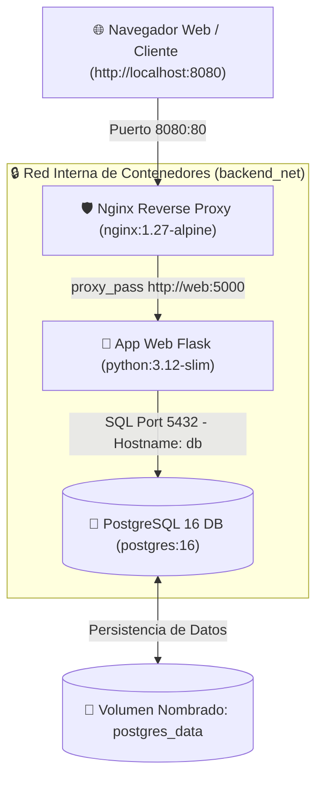

<div align="center">

  

  # 🐳 Docker desde Cero: Crea y Despliega Aplicaciones
  ### 🚀 10ma Edición 2026 | Programa de Iniciación Tecnológica (PIT 2026)
  **Oficina de Tecnologías de la Información (OTI) — Universidad Nacional de Ingeniería (UNI)**

  ---

  [](https://www.docker.com/)
  [](https://docs.docker.com/compose/)
  [](https://www.python.org/)
  [](https://flask.palletsprojects.com/)
  [](https://www.postgresql.org/)
  [](https://nginx.org/)
  [](https://www.uni.edu.pe)

</div>

<br/>

Repositorio oficial del curso **Docker desde Cero: Crea y Despliega Aplicaciones (10ma Edición 2026)**, impartido en el **Programa de Iniciación Tecnológica (PIT 2026)** de la **Oficina de Tecnologías de la Información (OTI)** de la **Universidad Nacional de Ingeniería (UNI)**.

> 👨‍🏫 **Instructor:** Cristian Jampier Chileno Segundo (Astra) — *OTI / Universidad Nacional de Ingeniería (UNI)*  
> 🎯 **Objetivo del Curso:** Dominar la tecnología de contenedores Docker, creación de recetas Dockerfile profesionales, orquestación de servicios con Docker Compose, persistencia de datos en bases de datos PostgreSQL, imágenes optimizadas con Multi-Stage builds, Reverse Proxy Nginx y automatización de despliegues reproducibles.

---

## 🗺️ Estructura Completa del Curso por Sesión (1 a 6)

Cada sesión del curso cuenta con su **Clase Teórica**, su **Trabajo/Laboratorio a Realizar**, su **Código Fuente de Ejemplo** y su **Guía Docente**:

| Sesión | Tema Principal | 📖 Clase Teórica | 🧪 Trabajo / Lab a Realizar | 💻 Código Fuente | 🎙️ Guía Docente |
|:---:|---|:---:|:---:|:---:|:---:|
| **Sesión 01** | 🐳 **Contenedores desde Cero** | [Ver Clase](./clases/01-contenedores-desde-cero.md) | [Realizar Lab 01](./laboratorios/sesion1/README.md) | [Código S1](./codigo/sesion1/) | [Guía S1](./material/guias/guia_docente_sesion1.md) |
| **Sesión 02** | 📦 **Dockerfile Profesional** | [Ver Clase](./clases/02-dockerfile-profesional.md) | [Realizar Lab 02](./laboratorios/sesion2/README.md) | [Código S2](./codigo/sesion2/) | [Guía S2](./material/guias/guia_docente_sesion2.md) |
| **Sesión 03** | 🧩 **Docker Compose Multi-Contenedor** | [Ver Clase](./clases/03-docker-compose.md) | [Realizar Lab 03](./laboratorios/sesion3/README.md) | [Código S3](./codigo/sesion3/) | [Guía S3](./material/guias/guia_docente_sesion3.md) |
| **Sesión 04** | 🌐 **Redes, Volúmenes y Persistencia** | [Ver Clase](./clases/04-redes-volumenes-persistencia.md) | [Realizar Lab 04](./laboratorios/sesion4/README.md) | [Código S4](./codigo/sesion4/) | [Guía S4](./material/guias/guia_docente_sesion4.md) |
| **Sesión 05** | 🛡️ **Docker en Producción (Proxy & Multi-Stage)** | [Ver Clase](./clases/05-docker-en-produccion.md) | [Realizar Lab 05](./laboratorios/sesion5/README.md) | [Código S5](./codigo/sesion5/) | [Guía S5](./material/guias/guia_docente_sesion5.md) |
| **Sesión 06** | 🚀 **Proyecto Final y Despliegue Completo** | [Ver Clase](./clases/06-proyecto-final.md) | [Realizar Lab 06](./laboratorios/sesion6/README.md) | [Código S6](./codigo/sesion6/) | [Guía S6](./material/guias/guia_docente_sesion6.md) |

---

## 🏛️ Arquitectura del Stack Final de Producción

Durante el curso, los alumnos construyen paso a paso la siguiente infraestructura completa:



---

## 🚀 Inicio Rápido

Para clonar el repositorio y ejecutar el laboratorio integrador final en tu máquina local:

```bash
# 1. Clonar el repositorio
git clone https://github.com/Crsitian22/docker-desde-cero-pit.git
cd docker-desde-cero-pit

# 2. Entrar a la carpeta del laboratorio final
cd codigo/sesion6

# 3. Levantar la infraestructura en segundo plano
docker compose up -d --build

# 4. Probar desde el navegador
curl http://localhost:8080
```

---

## 📂 Estructura del Repositorio

```text
docker-desde-cero-pit/
├── 📁 clases/                 # Guías y lecturas teóricas de cada sesión (01 a 06)
├── 📁 codigo/                 # Código fuente ordenado por sesión (Sesiones 1 a 6)
│   ├── sesion1/               # App Flask inicial en contenedor
│   ├── sesion2/               # Dockerfile profesional con .dockerignore
│   ├── sesion3/               # Stack Flask + PostgreSQL con Docker Compose
│   ├── sesion4/               # Redes privadas, volúmenes y backups SQL
│   ├── sesion5/               # Nginx Reverse Proxy y Multi-Stage Build
│   └── sesion6/               # Proyecto final multi-entorno y script desplegar.sh
├── 📁 laboratorios/           # Guías de trabajos y ejercicios a realizar por el alumno (Sesiones 1 a 6)
│   ├── sesion1/
│   ├── sesion2/
│   ├── sesion3/
│   ├── sesion4/
│   ├── sesion5/
│   └── sesion6/
├── 📁 material/               # Material docente exclusivo
│   └── guias/                 # Guías diapo por diapo (S1-S6) y banco de 108 evaluaciones
└── 📄 README.md               # Portada oficial del curso
```

---

## 📝 Banco de Evaluaciones y Tests (108 Preguntas)

El curso incluye un banco completo de preguntas para el aula virtual y dinámicas de clase:
- 📄 **Documento:** [`material/guias/evaluaciones_y_test_docker.md`](./material/guias/evaluaciones_y_test_docker.md)
- 📋 **Contenido:**
  - **72 Preguntas de Test Formativo** (12 por sesión de opción múltiple A, B, C, D con solucionario argumentado).
  - **36 Preguntas de Quiz en Vivo** (6 por sesión para pausas activas durante la clase).

---

## 💻 Requisitos del Sistema

- **Docker:** Docker Desktop (Windows/macOS) o Docker Engine (Linux).
- **Docker Compose:** Versión 2.x o superior (`docker compose`).
- **Terminal:** Bash / PowerShell / Zsh.
- **Hardware Recomendado:** 4 GB de RAM (8 GB recomendado).

---

## 👨‍🏫 Información del Docente y Créditos

- **Docente:** Cristian Jampier Chileno Segundo (Astra)
- **Institución:** Oficina de Tecnologías de la Información (OTI) — Universidad Nacional de Ingeniería (UNI)
- **Programa:** Programa de Iniciación Tecnológica (PIT 2026) — 10ma Edición
- **Licencia:** Material educativo de acceso libre para la comunidad de la UNI.
