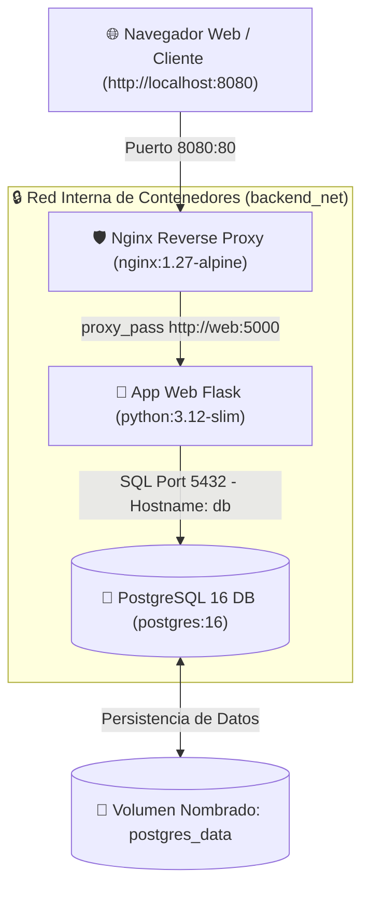

<div align="center">

  

  # 🐳 Docker desde Cero: Crea y Despliega Aplicaciones
  ### 🚀 10ma Edición 2026 | Programa de Iniciación Tecnológica (PIT 2026)
  **Oficina de Tecnologías de la Información (OTI) — Universidad Nacional de Ingeniería (UNI)**

  ---

  [](https://www.docker.com/)
  [](https://docs.docker.com/compose/)
  [](https://www.python.org/)
  [](https://flask.palletsprojects.com/)
  [](https://www.postgresql.org/)
  [](https://nginx.org/)
  [](https://www.uni.edu.pe)

</div>

<br/>

Repositorio oficial del curso **Docker desde Cero: Crea y Despliega Aplicaciones (10ma Edición 2026)**, impartido en el **Programa de Iniciación Tecnológica (PIT 2026)** de la **Oficina de Tecnologías de la Información (OTI)** de la **Universidad Nacional de Ingeniería (UNI)**.

> 👨‍🏫 **Instructor:** Ing. Cristian Jampier Chileno Segundo (Astra) — *OTI / Universidad Nacional de Ingeniería (UNI)*  
> 🎯 **Objetivo:** Dominar el uso de contenedores Docker, creación de Dockerfiles profesionales, orquestación con Docker Compose, persistencia de datos, seguridad, imágenes Multi-Stage, Nginx Reverse Proxy y despliegues reproducibles de desarrollo a producción.

---

## 🏛️ Arquitectura del Stack Final de Producción

En el transcurso de las 6 sesiones, los alumnos construyen de forma progresiva una infraestructura completa containerizada:



---

## 🚀 Inicio Rápido

Para clonar y levantar la infraestructura completa del laboratorio final en tu máquina local:

```bash
# 1. Clonar el repositorio
git clone https://github.com/Crsitian22/docker-desde-cero-pit.git
cd docker-desde-cero-pit

# 2. Entrar a la carpeta del laboratorio final
cd codigo/sesion6

# 3. Levantar todo el stack en segundo plano
docker compose up -d --build

# 4. Probar en el navegador
curl http://localhost:8080
```

---

## 🗺️ Ruta de Aprendizaje del Curso (6 Sesiones)

| Sesión | Tema Principal | Guía Teórica | Laboratorio Práctico | Código Fuente |
|:---:|---|:---:|:---:|:---:|
| **01** | 🐳 **Contenedores desde Cero** | [📖 Ver Clase](./clases/01-contenedores-desde-cero.md) | [🧪 Lab 01](./laboratorios/sesion1/README.md) | [💻 Código S1](./codigo/sesion1/) |
| **02** | 📦 **Dockerfile Profesional** | [📖 Ver Clase](./clases/02-dockerfile-profesional.md) | [🧪 Lab 02](./laboratorios/sesion2/README.md) | [💻 Código S2](./codigo/sesion2/) |
| **03** | 🧩 **Docker Compose Multi-Contenedor** | [📖 Ver Clase](./clases/03-docker-compose.md) | [🧪 Lab 03](./laboratorios/sesion3/README.md) | [💻 Código S3](./codigo/sesion3/) |
| **04** | 🌐 **Redes, Volúmenes y Persistencia** | [📖 Ver Clase](./clases/04-redes-volumenes-persistencia.md) | [🧪 Lab 04](./laboratorios/sesion4/README.md) | [💻 Código S4](./codigo/sesion4/) |
| **05** | 🛡️ **Docker en Producción (Proxy & Multi-Stage)** | [📖 Ver Clase](./clases/05-docker-en-produccion.md) | [🧪 Labs Producción](./laboratorios/sesion-final/labs-finales/README.md) | [💻 Código S5](./codigo/sesion5/) |
| **06** | 🚀 **Proyecto Final y Despliegue Completo** | [📖 Ver Clase](./clases/06-proyecto-final.md) | [🧪 Lab Proyecto Final](./laboratorios/sesion-final/labs-finales/README.md) | [💻 Código S6](./codigo/sesion6/) |

---

## 📚 Estructura General del Repositorio

```text
docker-desde-cero-pit/
├── 📁 clases/                 # Apuntes y guías teóricas resumidas (Sesiones 01 a 06)
├── 📁 codigo/                 # Código fuente ejecutable por cada sesión (Flask, Dockerfile, Compose)
│   ├── sesion1/
│   ├── sesion2/
│   ├── sesion3/
│   ├── sesion4/
│   ├── sesion5/
│   └── sesion6/
├── 📁 laboratorios/           # Guías paso a paso de los laboratorios prácticos para estudiantes
├── 📁 material/               # Material didáctico del docente
│   └── guias/                 # Guías diapo por diapo (S1-S6) y banco de 108 evaluaciones
├── 📁 bonus-ia/               # Módulo Bonus: IA, LLMs y Agentes para DevOps e Infraestructura
├── 📁 recursos/               # Diagramas, arquitecturas y gráficos de apoyo
└── 📄 README.md               # Documento principal del repositorio
```

---

## 📋 Resumen por Sesión

### 🔹 Sesión 1: Contenedores desde Cero
- **Conceptos:** Virtualización tradicional vs. Contenerización, Namespaces (PID, NET, MNT) y cgroups.
- **Comandos:** `docker run`, `docker ps`, `docker stop`, `docker rm`, `docker logs`, `docker exec`.
- **Ejercicio:** Despliegue de un primer contenedor web Flask en puerto `5000`.

### 🔹 Sesión 2: Dockerfile Profesional e Imágenes
- **Conceptos:** Instrucciones `FROM`, `WORKDIR`, `COPY`, `RUN`, `ENV`, `EXPOSE`, `CMD` Exec vs Shell.
- **Buenas Prácticas:** Optimización de capas de caché, uso de `.dockerignore`, tags y publicación en Docker Hub.
- **Ejercicio:** Empaquetado inmutable de app Python/Flask y `docker push` al registro.

### 🔹 Sesión 3: Docker Compose y Apps Multi-Contenedor
- **Conceptos:** Sintaxis declarativa YAML, `services:`, `volumes:`, `networks:`, `depends_on:`.
- **Seguridad:** Aislamiento de credenciales con archivo `.env` y plantilla `.env.example`.
- **Ejercicio:** Stack integrado Flask + PostgreSQL en la red interna de Docker.

### 🔹 Sesión 4: Redes, Volúmenes y Persistencia
- **Conceptos:** Volúmenes Nombrados vs. Bind Mounts, redes virtuales bridge aisladas, Healthchecks (`pg_isready`).
- **Seguridad & Respaldo:** Ocultamiento de puertos internos (Hardening) y respaldo SQL en caliente con `pg_dump -T`.
- **Ejercicio:** Persistencia de PostgreSQL y automatización de respaldos `.sql`.

### 🔹 Sesión 5: Docker en Producción (Reverse Proxy & Multi-Stage)
- **Conceptos:** Reverse Proxy Nginx (`proxy_pass`), construcción Multi-Stage (`builder` vs `runtime`).
- **Observabilidad:** Límites de memoria RAM/CPU (`deploy.resources`), prevención de OOM Killer (Exit 137) y `docker stats`.
- **Ejercicio:** Stack Nginx (puerto 8080) -> Flask (5000 internal) -> PostgreSQL (5432 internal).

### 🔹 Sesión 6: Proyecto Final y Despliegue Completo
- **Conceptos:** Manejo multi-entorno con Compose Overrides (`-f compose.yml -f compose.prod.yml`).
- **Automatización:** Script de despliegue en Bash (`desplegar.sh`) con `set -euo pipefail`.
- **Ejercicio:** Prueba de reconstrucción 100% reproducible del stack completo desde cero.

---

## 📝 Banco de Evaluaciones y Tests (108 Preguntas)

El repositorio incluye un documento de evaluación listo para ser utilizado en aulas virtuales o exámenes:
- 📄 **Ubicación:** [`material/guias/evaluaciones_y_test_docker.md`](./material/guias/evaluaciones_y_test_docker.md)
- 📌 **Contenido:**
  - **72 Preguntas de Test Asíncrono** (12 por sesión con opciones múltiples A, B, C, D y solucionario argumentado).
  - **36 Preguntas de Quiz en Vivo** (6 por sesión para dinámicas de clase en tiempo real).

---

## 🤖 Bonus: Inteligencia Artificial para DevOps e Infraestructura

Ubicado en [`bonus-ia/README.md`](./bonus-ia/README.md), este módulo introduce cómo utilizar modelos de lenguaje (LLMs), agentes conversacionales, protocolo MCP y herramientas como OpenCode/Claude para auditar Dockerfiles, depurar logs de contenedores y optimizar infraestructuras como código.

---

## 💻 Requisitos del Sistema

- **Motor Docker:** Docker Desktop (Windows/macOS) o Docker Engine (Linux).
- **Herramienta Compose:** `docker compose` v2.x+.
- **Terminal:** Bash / PowerShell / Zsh.
- **Hardware Mínimo:** 4 GB de RAM (8 GB recomendado).

---

## 👨‍🏫 Información del Docente y Créditos

- **Docente:** Ing. Cristian Jampier Chileno Segundo (Astra)
- **Institución:** Oficina de Tecnologías de la Información (OTI) — Universidad Nacional de Ingeniería (UNI)
- **Programa:** Programa de Iniciación Tecnológica (PIT 2026) — 10ma Edición
- **Licencia:** Material educativo de acceso libre para estudiantes y la comunidad tecnológica.
